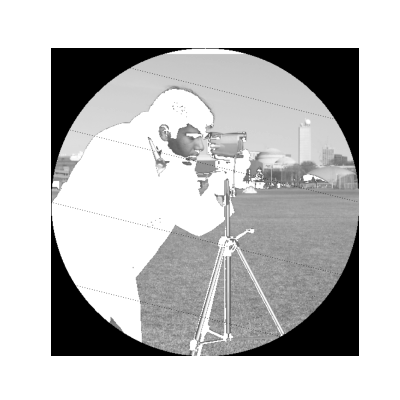
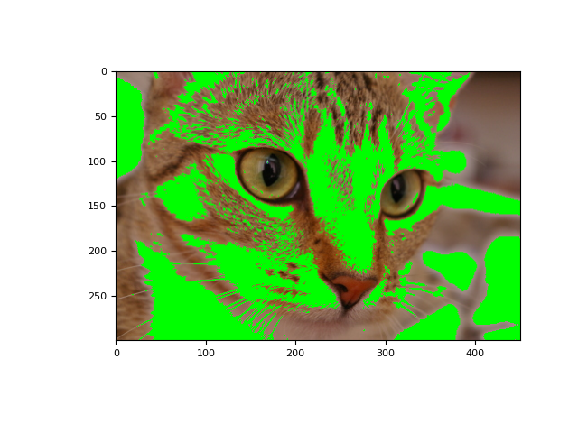

# خلاصه ای از numpy برای درک بهتر

تصاویر در scikit-image با NumPy نشان داده می شوند. بنابراین ، بسیاری از عملیات متداول را می توان با استفاده از روش های استاندارد NumPy برای دستکاری آرایه ها بدست آورد:

```python
>>> from skimage import data
>>> camera = data.camera()
>>> type(camera)
<type 'numpy.ndarray'>
```

بازیابی اطلاعات اندازه ی طول و عرض و کانال های رنگی تصویر و تعداد پیکسل ها:

```python
>>> camera.shape
(512, 512)
>>> camera.size
262144
```

بازیابی اطلاعات آماری در مورد مقادیر intensity تصویر:

```python
>>> camera.min(), camera.max()
(0, 255)
>>> camera.mean()
118.31400299072266
```

آرایه های NumPy که تصاویر را نشان می دهند می توانند انواع مختلف عددی صحیح integer یا شناور float داشته باشند.


### دسترسی به بخش های مختلف آرایه ها با اندیس های NumPy

از اندیس گذاری در NumPy می توان هم برای مشاهده مقادیر پیکسل ها و هم برای ویرایش آنها استفاده کرد:

```python
>>> # Get the value of the pixel at the 10th row and 20th column
>>> camera[10, 20]
153
>>> # Set to black the pixel at the 3rd row and 10th column
>>> camera[3, 10] = 0
```

مراقب باشید! در استفاده از اندیس های NumPy ، اولین عدد \(camera.shape \[0\]\) مربوط به ردیف ها است ، در حالی که دومین عدد \(camera.shape \[1\]\) مربوط به ستون ها است.

فراتر از پیکسل های جداگانه ، امکان دسترسی/تغییر مقادیر مجموعه ای از پیکسل ها با استفاده از قابلیت های اندیس گذاری مختلف در NumPy وجود دارد.

برشی از یک بخش آرایه:

```python
>>> # Set the first ten lines to "black" (0)
>>> camera[:10] = 0
```

مثالی از Masking \(استفاده از اندیس ها با ماسک های بولین\):

```python
>>> mask = camera < 87
>>> # Set to "white" (255) the pixels where mask is True
>>> camera[mask] = 255
```

استفاده از اندیس ها با مجموعه ای از شاخص ها:

```python
>>> inds_r = np.arange(len(camera))
>>> inds_c = 4 * inds_r % len(camera)
>>> camera[inds_r, inds_c] = 0
```

ماسک ها زمانی بسیار مفید هستند که شما نیاز به انتخاب مجموعه ای از پیکسل ها داشته باشید که روی آنها دستکاری ها یا تغییراتی را انجام دهید. ماسک ها می توانند هر آرایه بولی با همان شکل تصویر \(یا شکلی قابل پخش به شکل تصویر\) باشد. این می تواند برای تعریف منطقه مورد علاقه ، به عنوان مثال ، بخش دایره ای استفاده شود:

```python
>>> nrows, ncols = camera.shape
>>> row, col = np.ogrid[:nrows, :ncols]
>>> cnt_row, cnt_col = nrows / 2, ncols / 2
>>> outer_disk_mask = ((row - cnt_row)**2 + (col - cnt_col)**2 >
...                    (nrows / 2)**2)
>>> camera[outer_disk_mask] = 0
```



عملیات بولی NumPy را می توان برای تعریف ماسک های پیچیده تر استفاده کرد:

```python
>>> lower_half = row > cnt_row
>>> lower_half_disk = np.logical_and(lower_half, outer_disk_mask)
>>> camera = data.camera()
>>> camera[lower_half_disk] = 0
```


### تصاویر رنگی

همه موارد بالا در مورد تصاویر رنگی هم قابل استفاده هستند. یک تصویر رنگی یک آرایه NumPy با یک بعد دنباله ای اضافی برای کانال های رنگی است:

```python
>>> cat = data.chelsea()
>>> type(cat)
<type 'numpy.ndarray'>
>>> cat.shape
(300, 451, 3)
```

کد بالا نشان می دهد که تصویر گربه یک تصویر 300 در 451 پیکسل با سه کانال رنگی \(قرمز ، سبز و آبی\) است. مانند قبل ، می توانیم مقادیر پیکسل را بدست آوریم و تغییر دهیم:

```python
>>> cat[10, 20]
array([151, 129, 115], dtype=uint8)
>>> # Set the pixel at (50th row, 60th column) to "black"
>>> cat[50, 60] = 0
>>> # set the pixel at (50th row, 61st column) to "green"
>>> cat[50, 61] = [0, 255, 0]  # [red, green, blue]
```

همچنین می توانیم از ماسک های بولی دو بعدی برای تصاویر چند کاناله دو بعدی یا رنگی استفاده کنیم ، همانطور که در تصویر خاکستری بالا این کار را انجام دادیم:

استفاده از ماسک دو بعدی روی تصویر رنگی دو بعدی:

```python
>>> from skimage import data
>>> cat = data.chelsea()
>>> reddish = cat[:, :, 0] > 160
>>> cat[reddish] = [0, 255, 0]
>>> plt.imshow(cat)
```




### مختصات و قرارداد آن ها را دقت کنید.

از آنجایی که scikit-image تصاویر را با استفاده از آرایه های NumPy نشان می دهد، شرایط مختصات باید مطابقت داشته باشد. تصاویر مقیاس خاکستری دو بعدی با ردیف ها و ستون ها اندیس بندی می شوند. گوشه سمت چپ بالا مبدا تصویر است. معمولاً مختصات تصویر با استاندارد دکارتی پیروی می شود، جایی که x مختصات افقی، y عمودی است.

از سطر با عنوان row یا r استفاده می شود و از ستون با عنوان col یا c یاد می شود.

در مورد تصاویر چند کاناله یا رنگی، آخرین بعد برای کانال های رنگی استفاده می شود و با کانال یا ch نشان داده می شود.

در نهایت ، برای تصاویر حجمی \(سه بعدی\)، مانند فیلم ها، اسکن های تصویربرداری مغناطیسی \(MRI\) ، میکروسکوپ کانوکال و ...، ما از بعد اصلی به عنوان صفحه، به اختصار pln یا p اشاره می کنیم.

در نهایت این قرارداد ها در جدول زیر خلاصه شده است:

| قراردادها | نوع تصویر |
| :--- | :--- |
| \(row, col\) | دوبعدی خاکستری یا grayscale |
| \(row, col, ch\) | دوبعدی چندکاناله مثل RGB |
| \(pln, row, col\) | سه بعدی خاکستری یا grayscale |
| \(pln, row, col, ch\) | سه بعدی چندکاناله |

بسیاری از توابع در scikit-image می توانند مستقیماً روی تصاویر سه بعدی کار کنند:

```python
>>> rng = np.random.default_rng()
>>> im3d = rng.random((100, 1000, 1000))
>>> from skimage import morphology
>>> from scipy import ndimage as ndi
>>> seeds = ndi.label(im3d < 0.1)[0]
>>> ws = morphology.watershed(im3d, seeds)
```

در بسیاری از موارد، با این حال، بعد فضایی یا بعد سوم وضوح کمتری نسبت به دو بعد دیگر دارد. برخی از توابع scikit-image یک آرگومان کلید واژه فاصله برای کمک به مدیریت این نوع داده ها ارائه می دهند:

```python
>>> from skimage import segmentation
>>> slics = segmentation.slic(im3d, spacing=[5, 1, 1], multichannel=False)
```

در مواقع دیگر باید به صورت زیر عمل کرد:

```python
>>> from skimage import filters
>>> edges = np.empty_like(im3d)
>>> for pln, image in enumerate(im3d):
...     # Iterate over the leading dimension
...     edges[pln] = filters.sobel(image)
```


### نکاتی در مورد ترتیب ابعاد آرایه

اگرچه برچسب زدن محورها ممکن است دلخواه به نظر برسد، اما می تواند تأثیر قابل توجهی بر سرعت عملیات های شما داشته باشد. این امر به این دلیل است که پردازنده های مدرن هرگز فقط یک مورد را از حافظه بازیابی نمی کنند، بلکه یک قسمت کامل از اجزای مجاور \(عملیاتی به نام پیش واکشی یا prefetching\) را بر میگردانند. بنابراین، پردازش عناصری که در کنار هم در حافظه قرار دارند سریعتر از پردازش آنها هنگام پراکنده شدن است، حتی اگر تعداد عملیات ها یکسان باشد:

```python
>>> def in_order_multiply(arr, scalar):
...     for plane in list(range(arr.shape[0])):
...         arr[plane, :, :] *= scalar
...
>>> def out_of_order_multiply(arr, scalar):
...     for plane in list(range(arr.shape[2])):
...         arr[:, :, plane] *= scalar
...
>>> import time
>>> rng = np.random.default_rng()
>>> im3d = rng.random((100, 1024, 1024))
>>> t0 = time.time(); x = in_order_multiply(im3d, 5); t1 = time.time()
>>> print("%.2f seconds" % (t1 - t0))  
0.14 seconds
>>> s0 = time.time(); x = out_of_order_multiply(im3d, 5); s1 = time.time()
>>> print("%.2f seconds" % (s1 - s0))  
1.18 seconds
>>> print("Speedup: %.1fx" % ((s1 - s0) / (t1 - t0)))  
Speedup: 8.6x
```


این بخش به پایان رسید اگر سوالی در ارتباط با هر یک از بخش های بالا دارید در بخش [issueها ](https://github.com/amirshnll/skimage-persian-userguide/issues)از من بپرسید.

