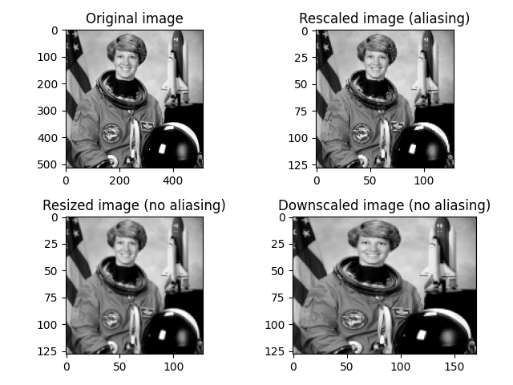
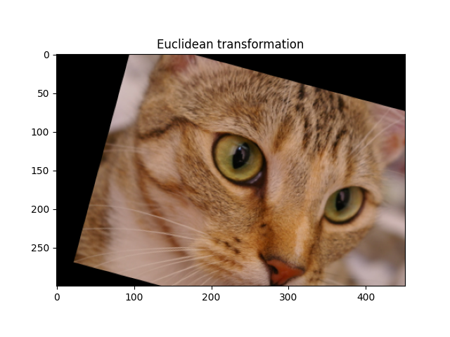
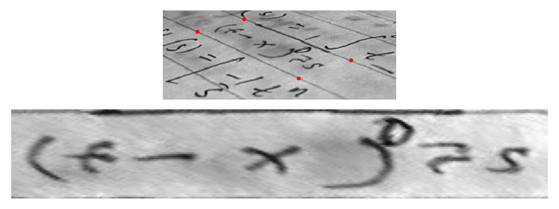
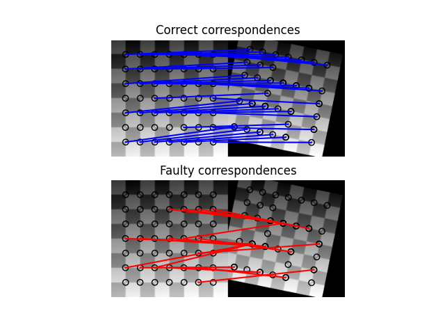
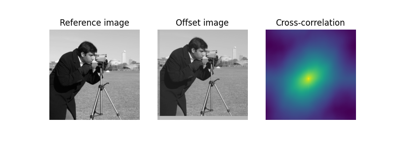

# تغییرات هندسی در تصاویر

برش، تغییر اندازه و مقیاس کردن مجدد تصاویر

تصاویری که آرایه های NumPy هستند \([همانطور که در بخش خلاصه ای از numpy توضیح داده شد](a-crash-course-on-numpy-for-images.md)\)، برش تصویر را می توان با عملیات برش ساده انجام داد. در زیر یک مربع 100x100 که مربوط به گوشه سمت چپ بالای تصویر فضانورد است برش می دهیم. توجه داشته باشید که این عملیات برای همه کانال های رنگی انجام می شود \(بُعد رنگ آخرین بُعد و بُعد سوم است\):

```python
>>> from skimage import data
>>> img = data.astronaut()
>>> top_left = img[:100, :100]
```

به منظور تغییر شکل تصویر، skimage.color چندین عملکرد را که در Rescale، [تغییر اندازه و مقیاس کوچک توضیح داده شده است](https://scikit-image.org/docs/dev/auto_examples/transform/plot_rescale.html#sphx-glr-auto-examples-transform-plot-rescale-py)، ارائه می دهد.

```python
from skimage import data, color
from skimage.transform import rescale, resize, downscale_local_mean

image = color.rgb2gray(data.astronaut())

image_rescaled = rescale(image, 0.25, anti_aliasing=False)
image_resized = resize(image, (image.shape[0] // 4, image.shape[1] // 4),
                       anti_aliasing=True)
image_downscaled = downscale_local_mean(image, (4, 3))
```




تحولات نمایشی \(هموگرافی\)

هموگرافی ها تغییراتی در فضای اقلیدسی هستند که هم ترازی نقاط را حفظ می کنند. موارد خاص هموگرافی مربوط به حفظ خواص بیشتری است، مانند موازی کاری \(دگرگونی آفینی\)، شکل \(دگرگونی مشابه\) یا فاصله ها \(دگرگونی اقلیدسی\). انواع مختلف هموگرافی موجود در تصویر scikit [در انواع هموگرافی ارائه شده است](https://scikit-image.org/docs/dev/auto_examples/transform/plot_transform_types.html#sphx-glr-auto-examples-transform-plot-transform-types-py).

تحولات پیش بینی شده را می توان با استفاده از پارامترهای صریح \(به عنوان مثال مقیاس، برش، چرخش و ترجمه\) ایجاد کرد:

```python
from skimage import data
from skimage import transform
from skimage import img_as_float

tform = transform.EuclideanTransform(
   rotation=np.pi / 12.,
   translation = (100, -20)
   )
```

یا ماتریس تبدیل کامل \(full transformation matrix\) :

```python
from skimage import data
from skimage import transform
from skimage import img_as_float

matrix = np.array([[np.cos(np.pi/12), -np.sin(np.pi/12), 100],
                   [np.sin(np.pi/12), np.cos(np.pi/12), -20],
                   [0, 0, 1]])
tform = transform.EuclideanTransform(matrix)
```

ماتریس تبدیل یک تبدیل به عنوان ویژگی tform.params موجود است. تبدیل ها را می توان با ضرب ماتریس ها با عملگر ضرب ماتریس @ تشکیل داد.

ماتریس های تبدیل از مختصات یکنواخت استفاده می کنند، که گسترش مختصات دکارتی مورد استفاده در هندسه اقلیدسی به هندسه پیش بینی کلی تر است. به طور خاص، نقاط بی نهایت را می توان با مختصات محدود نشان داد.

با استفاده از skimage.transform.warp\(\) می توان تغییرات را روی تصاویر اعمال کرد:

```python
img = img_as_float(data.chelsea())
tf_img = transform.warp(img, tform.inverse)
```



دگرگونی های مختلف در skimage.trans یک روش تخمینی برای تخمین پارامترهای تبدیل از دو مجموعه نقطه \(مبدا و مقصد\) دارد، همانطور که در[ آموزش استفاده از تغییرات هندسی توضیح داده شده است](https://scikit-image.org/docs/dev/auto_examples/transform/plot_geometric.html#sphx-glr-auto-examples-transform-plot-geometric-py):

```python
text = data.text()

src = np.array([[0, 0], [0, 50], [300, 50], [300, 0]])
dst = np.array([[155, 15], [65, 40], [260, 130], [360, 95]])

tform3 = transform.ProjectiveTransform()
tform3.estimate(src, dst)
warped = transform.warp(text, tform3, output_shape=(50, 300))
```



روش برآورد از بهینه سازی حداقل مربعات برای به حداقل رساندن فاصله بین منبع و بهینه سازی استفاده می کند. نقاط مبدا و مقصد را می توان به صورت دستی یا با استفاده از روش های مختلف برای تشخیص ویژگی های موجود در skimage.feature بدست آورد، مانند:

* [Corner detection](https://scikit-image.org/docs/dev/auto_examples/features_detection/plot_corner.html#sphx-glr-auto-examples-features-detection-plot-corner-py)
* [ORB feature detector and binary descriptor](https://scikit-image.org/docs/dev/auto_examples/features_detection/plot_orb.html#sphx-glr-auto-examples-features-detection-plot-orb-py)
* [BRIEF binary descriptor](https://scikit-image.org/docs/dev/auto_examples/features_detection/plot_brief.html#sphx-glr-auto-examples-features-detection-plot-brief-py)

و نقاط تطبیق با استفاده از skimage.feature.match\_descriptors\(\) قبل از برآورد پارامترهای تبدیل بدست می آید. با این حال، مسابقات تقلبی اغلب انجام می شود، و توصیه می شود از الگوریتم RANSAC \(به جای بهینه سازی ساده حداقل مربعات\) برای بهبود استحکام بیشتر استفاده کنید، همانطور که در تطبیق قوی با استفاده [از RANSAC توضیح داده شده است.](https://scikit-image.org/docs/dev/auto_examples/transform/plot_matching.html#sphx-glr-auto-examples-transform-plot-matching-py)



مثالهایی که کاربردهای برآورد دگرگونی را نشان می دهند:

* stereo matching [Fundamental matrix estimation](https://scikit-image.org/docs/dev/auto_examples/transform/plot_fundamental_matrix.html#sphx-glr-auto-examples-transform-plot-fundamental-matrix-py)
* image rectification [Using geometric transformations](https://scikit-image.org/docs/dev/auto_examples/transform/plot_geometric.html#sphx-glr-auto-examples-transform-plot-geometric-py)

روش برآورد مبتنی بر نقطه است، یعنی فقط از مجموعه نقاطی از تصاویر مبدا و مقصد استفاده می کند. برای برآورد ترجمه ها \(شیفت ها\) ،همچنین می توان از یک روش کامل میدان با استفاده از تمام پیکسل ها، بر اساس همبستگی متقابل فوریه و فضا استفاده کرد. این روش توسط skimage.registration.register\_translation\(\) پیاده سازی شده و [در آموزش ثبت تصویر توضیح داده شده است.](https://scikit-image.org/docs/dev/auto_examples/registration/plot_register_translation.html#sphx-glr-auto-examples-registration-plot-register-translation-py)



آموزش استفاده از تحولات قطبی و Log-Polar for Registration یک نوع از این روش کامل میدان برای تخمین چرخش را با استفاده از ابتدا یک تغییر شکل قطبی توضیح می دهد.


این بخش به پایان رسید اگر سوالی در ارتباط با هر یک از بخش های بالا دارید در بخش [issueها ](https://github.com/amirshnll/skimage-persian-userguide/issues)از من بپرسید.

