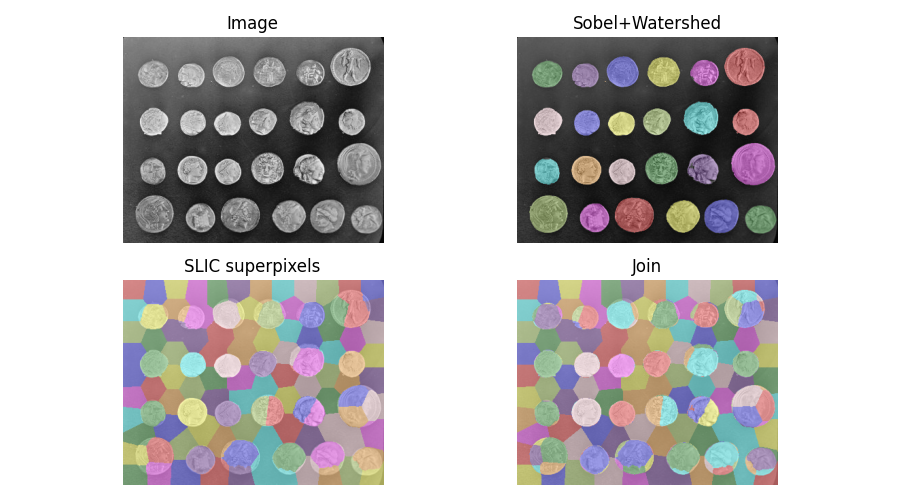
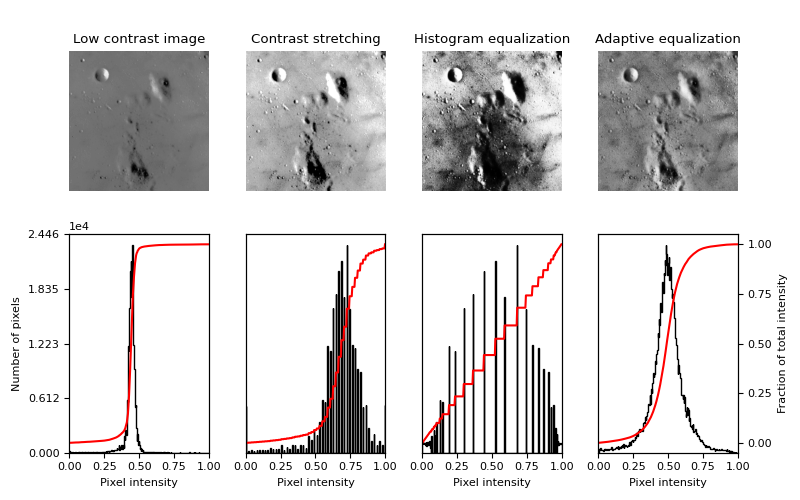

# تنظیم تصویر: تغییر محتوای تصویر

### دستکاری رنگ ها

اکثر توابع برای دستکاری کانال های رنگی در زیر ماژول skimage.color یافت می شوند.


### تبدیل بین مدل های رنگی

تصاویر رنگی را می توان با استفاده از فضاهای رنگی مختلف نشان داد. یکی از رایج ترین فضاهای رنگی، فضای RGB است، جایی که یک تصویر دارای کانال های قرمز، سبز و آبی است. با این حال، مدل های رنگی دیگر به طور گسترده ای مورد استفاده قرار می گیرند، مانند مدل رنگی HSV، که در آن رنگ، اشباع و مقدار کانال های مستقل هستند، یا مدل CMYK که برای چاپ استفاده می شود.

در واقع skimage.color توابع مفیدی را برای تبدیل تصاویر به و از فضاهای رنگی مختلف فراهم می کند. آرایه های نوع صحیح را می توان با عملیات تبدیل به نوع float تبدیل کرد:

```python
>>> # bright saturated red
>>> red_pixel_rgb = np.array([[[255, 0, 0]]], dtype=np.uint8)
>>> color.rgb2hsv(red_pixel_rgb)
array([[[ 0.,  1.,  1.]]])
>>> # darker saturated blue
>>> dark_blue_pixel_rgb = np.array([[[0, 0, 100]]], dtype=np.uint8)
>>> color.rgb2hsv(dark_blue_pixel_rgb)
array([[[ 0.66666667,  1.  ,  0.39215686]]])
>>> # less saturated pink
>>> pink_pixel_rgb = np.array([[[255, 100, 255]]], dtype=np.uint8)
>>> color.rgb2hsv(pink_pixel_rgb)
array([[[ 0.83333333,  0.60784314,  1.  ]]])
```


### تبدیل از RGBA به RGB - حذف کانال آلفا از طریق ترکیب آلفا

تبدیل تصویر RGBA به تصویر RGB با ترکیب آلفا با پس زمینه با rgba2rgb\(\) :

```python
>>> from skimage.color import rgba2rgb
>>> from skimage import data
>>> img_rgba = data.logo()
>>> img_rgb = rgba2rgb(img_rgba)
```


### تبدیل بین تصویر رنگی و خاکستری

تبدیل تصویر RGB به تصویر مقیاس خاکستری با rgb2gray\(\) انجام می شود:

```python
>>> from skimage.color import rgb2gray
>>> from skimage import data
>>> img = data.astronaut()
>>> img_gray = rgb2gray(img)
```

تابع rgb2gray\(\) از وزن دهی یکنواخت کانال های رنگی استفاده می کند، زیرا حساسیت متفاوت چشم انسان به رنگ های مختلف است. بنابراین، چنین وزنی حفظ روشنایی از RGB تا مقیاس خاکستری را تضمین می کند:

```python
>>> red_pixel = np.array([[[255, 0, 0]]], dtype=np.uint8)
>>> color.rgb2gray(red_pixel)
array([[ 0.2125]])
>>> green_pixel = np.array([[[0, 255, 0]]], dtype=np.uint8)
>>> color.rgb2gray(green_pixel)
array([[ 0.7154]])
```

تبدیل تصویر در مقیاس خاکستری به RGB با grey2rgb\(\) به سادگی مقادیر خاکستری را در سه کانال رنگی کپی می کند.


### وارونگی تصویر

به تصویر معکوس نیز تصویر مکمل گفته می شود. برای تصاویر باینری، مقادیر True اشتباه و برعکس می شوند. برای تصاویر مقیاس خاکستری، مقادیر پیکسل با تفاوت حداکثر مقدار نوع داده و مقدار واقعی جایگزین می شود. برای تصاویر RGB، عملکرد یکسانی برای هر کانال انجام می شود. این عملیات را می توان با skimage.util.invert\(\) به دست آورد:

```python
>>> from skimage import util
>>> img = data.camera()
>>> inverted_img = util.invert(img)
```


### نقاشی تصاویر با برچسب

تابع \(\)label2rgb می تواند برای قرار دادن رنگ ها در تصویر مقیاس خاکستری با استفاده از آرایه ای از برچسب ها برای کد ناحیه هایی که با همان رنگ نمایش داده می شوند، استفاده شود.



**مثال ها:**

* [Tinting gray-scale images](https://scikit-image.org/docs/dev/auto_examples/color_exposure/plot_tinting_grayscale_images.html#sphx-glr-auto-examples-color-exposure-plot-tinting-grayscale-images-py)
* [Find the intersection of two segmentations](https://scikit-image.org/docs/dev/auto_examples/segmentation/plot_join_segmentations.html#sphx-glr-auto-examples-segmentation-plot-join-segmentations-py)
* [RAG Thresholding](https://scikit-image.org/docs/dev/auto_examples/segmentation/plot_rag_mean_color.html#sphx-glr-auto-examples-segmentation-plot-rag-mean-color-py)


### کنتراست و نوردهی

پیکسل های تصویر می توانند مقادیری را که با نوع تصویر تعیین می شوند \([نوع داده های تصویر و منظور آنها را ببینید](image-data-types-and-what-they-mean.md)\)، مانند 0 تا 255 برای تصاویر uint8 یا \[0 ، 1\] برای تصاویر float تعیین کنند. با این حال، اکثر تصاویر یا دارای محدوده باریک تری از مقادیر \(به دلیل کنتراست ضعیف\) هستند، یا بیشتر مقادیر پیکسل در زیر مجموعه ای از مقادیر قابل دسترسی متمرکز شده اند. [skimage.exposure](https://scikit-image.org/docs/dev/api/skimage.exposure.html#module-skimage.exposure) توابعی را ارائه می دهد که مقادیر شدت تصویر یا intensity را در محدوده بزرگتری پخش می کند.

دسته اول روش ها یک تابع غیر خطی از شدت تصویر یا intensity را محاسبه می کنند که مستقل از مقادیر پیکسل یک تصویر خاص است. چنین روش هایی اغلب برای تصحیح غیر خطی بودن حسگرها یا گیرنده هایی مانند چشم انسان استفاده می شود. یک مثال مشهور، تصحیح گاما است که در \(\)adjust\_gamma پیاده سازی شده است.

روش های دیگر مقادیر پیکسل را با توجه به هیستوگرام تصویر دوباره توزیع می کنند. هیستوگرام مقادیر پیکسل با skimage.exposure.histogram\(\) محاسبه می شود:

```python
>>> image = np.array([[1, 3], [1, 1]])
>>> exposure.histogram(image)
(array([3, 0, 1]), array([1, 2, 3]))
```

تابع histogram\(\) تعداد پیکسل ها برای هر سطر مقدار و مراکز سطل ها را برمی گرداند. بنابراین رفتار histogram\(\) کمی متفاوت از رفتار numpy.histogram\(\) است که مرزها را برمی گرداند.

ساده ترین راه افزایش کنتراست \(\)resale\_intensity شامل کشش مقادیر پیکسل در کل محدوده مجاز با استفاده از تبدیل خطی است:

```python
>>> from skimage import exposure
>>> text = data.text()
>>> text.min(), text.max()
(10, 197)
>>> better_contrast = exposure.rescale_intensity(text)
>>> better_contrast.min(), better_contrast.max()
(0, 255)
```

حتی اگر یک تصویر از کل محدوده مقدار هیستوگرام استفاده کند، گاهی اوقات وزن بسیار کمی در انتهای محدوده مقدار وجود دارد. در چنین حالتی، برش دادن مقادیر پیکسل با استفاده از صدک های تصویر کنتراست را بهبود می بخشد \(به دلیل از دست دادن اطلاعات، زیرا برخی از پیکسل ها در این عملیات اشباع شده اند\):

```python
>>> moon = data.moon()
>>> v_min, v_max = np.percentile(moon, (0.2, 99.8))
>>> v_min, v_max
(10.0, 186.0)
>>> better_contrast = exposure.rescale_intensity(
...                                     moon, in_range=(v_min, v_max))
```

تابع equalize\_hist\(\) تابع توزیع تجمعی \(cdf\) مقادیر پیکسل را بر روی یک cdf خطی ترسیم می کند و اطمینان حاصل می کند که همه قسمت های محدوده مقدار به طور یکسان در تصویر نشان داده شده است. در نتیجه، جزئیات در مناطق بزرگ با کنتراست ضعیف افزایش می یابد. برای اصلاح بیشتر، می توان همسان سازی هیستوگرام را در مناطق فرعی تصویر با \(\)equalize\_adapthist انجام داد تا شیب نوردهی را در سراسر تصویر تصحیح کند. [به مثال یکسان سازی هیستوگرام مراجعه کنید.](https://scikit-image.org/docs/dev/auto_examples/color_exposure/plot_equalize.html#sphx-glr-auto-examples-color-exposure-plot-equalize-py)



**مثال ها:**

* [Histogram Equalization](https://scikit-image.org/docs/dev/auto_examples/color_exposure/plot_equalize.html#sphx-glr-auto-examples-color-exposure-plot-equalize-py)


این بخش به پایان رسید اگر سوالی در ارتباط با هر یک از بخش های بالا دارید در بخش [issueها ](https://github.com/amirshnll/skimage-persian-userguide/issues)از من بپرسید.

